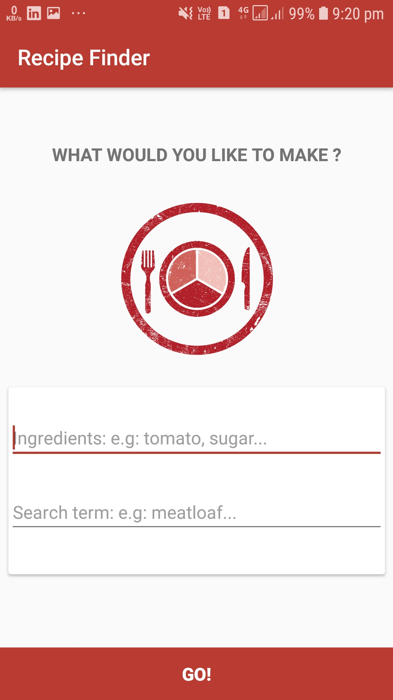
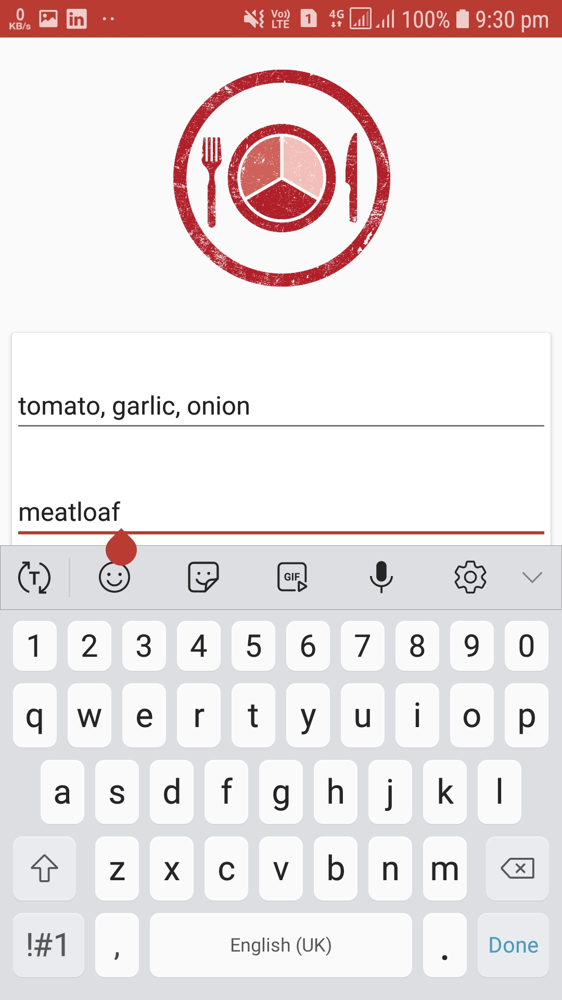
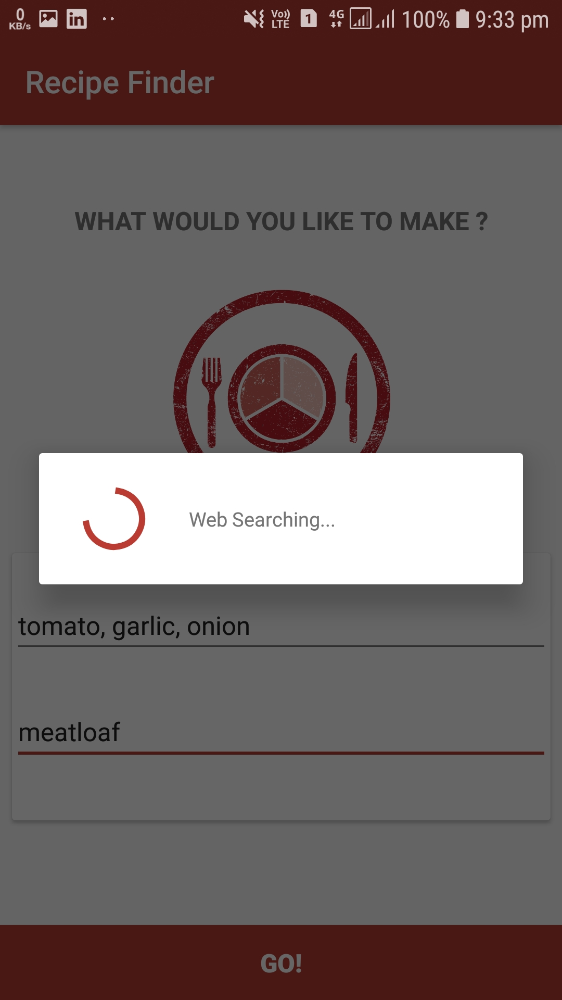
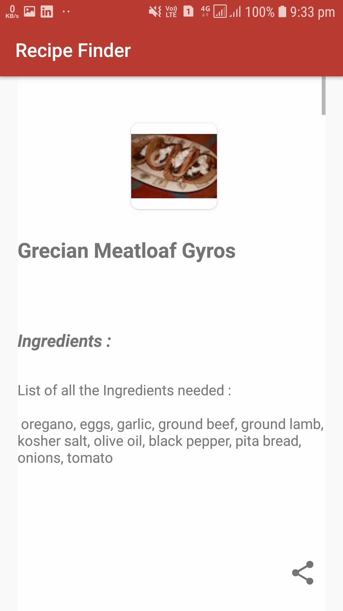
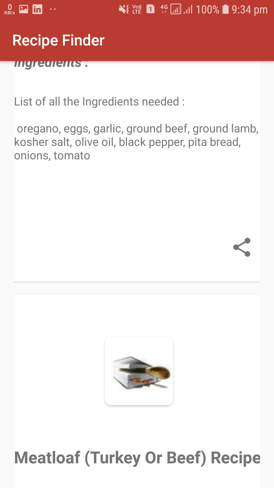
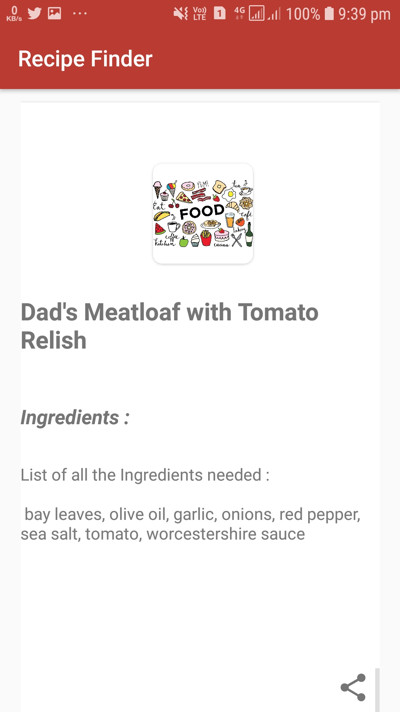
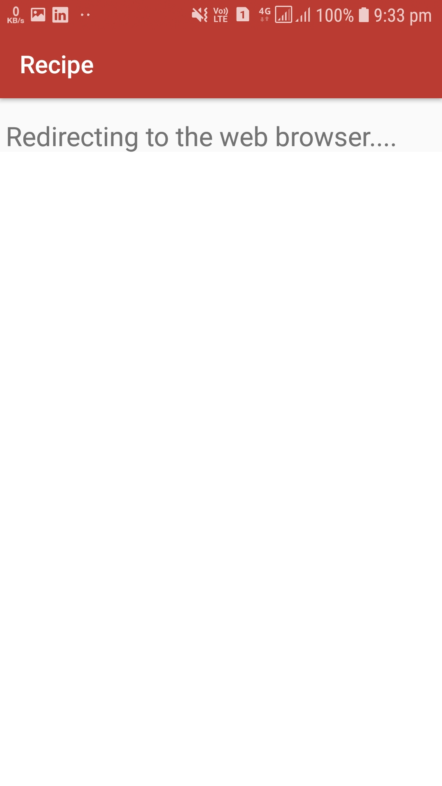
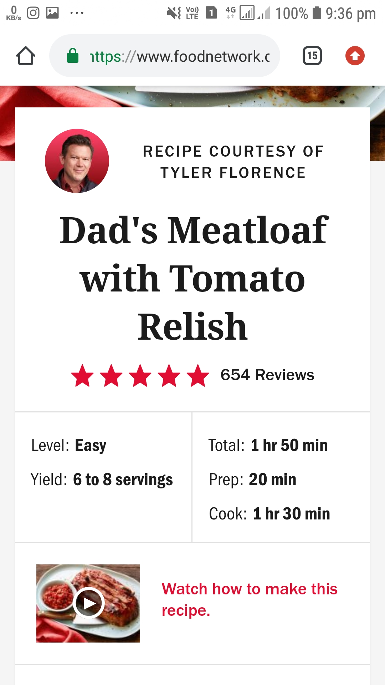

#  Recipe Finder app

## Overview

Build a Recipe Finder app with Remote API accessible using Google's Volley Library

It is a Recipe Finder app with Internet permissions enabled to access JSON data from remote API using Volley Library. The JSON data basically include JSON Objects and JSON Array as well. For every search of a recipe a custom ListView holds the info: `Recipe Title`, `Recipe Thumbnail`, `Recipe Ingredients` and `Link`. All the data of this ListView is Parsed from Remote API, more specifically [Recipe Puppy API](http://www.recipepuppy.com/about/api/) accessible with the help of [Volley Library](https://developer.android.com/training/volley/).

Its a Networking App which uses Google's Volley Networking Library!!

## Features

* Google's Volley Library
* Remote API
* Recipe Puppy API
* Splash screen
* Customised buttons
* Custom ListView
* CardView
* ImageView
* Minimal Design
* Simplified Theme
* Responsive BackPress
* Well Constrained Layout

## Platform
        -> Android Studio
        -> With Kotlin Support

## Instructions

1. Clone or download the repo: `https://github.com/ashish7zeph/android-kotlin-Recipe-app`
2. Navigate to the folder `android-kotlin-Recipe-app`
3. Navigate to the folder `android-kotlin-Recipe-app/app/src/` to access developers content
3. Navigate to the folder `apk` for users to access apk
4. Copy the apk from folder `apk` to an android phone
5. Install the apk

The app is finally installed on your Android mobile device !!

To directly download the apk visit the [link](https://github.com/ashish7zeph/android-kotlin-Recipe-app/tree/master/apk)

 # Screenshots:

 
 

 
 

## Kotlin Android Activity

For Kotlin code files visit the [link](https://github.com/ashish7zeph/android-kotlin-Recipe-app/tree/master/app/src/main/java/com/zeph7/recipefinder)

Backend files are stored in three packages:

* [activity](https://github.com/ashish7zeph/android-kotlin-Recipe-app/tree/master/app/src/main/java/com/zeph7/recipefinder/activity)
* [data](https://github.com/ashish7zeph/android-kotlin-Recipe-app/tree/master/app/src/main/java/com/zeph7/recipefinder/data)
* [model](https://github.com/ashish7zeph/android-kotlin-Recipe-app/tree/master/app/src/main/java/com/zeph7/recipefinder/model)

Frontend resource files are stored in `res` package

* [res](https://github.com/ashish7zeph/android-kotlin-Recipe-app/tree/master/app/src/main/res)

Android manifest file for the project:

* [AndroidManifest.xml](https://github.com/ashish7zeph/android-kotlin-Recipe-app/blob/master/app/src/main/AndroidManifest.xml)
